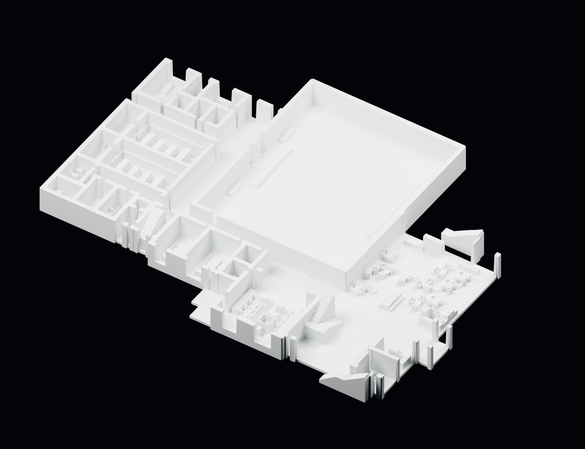
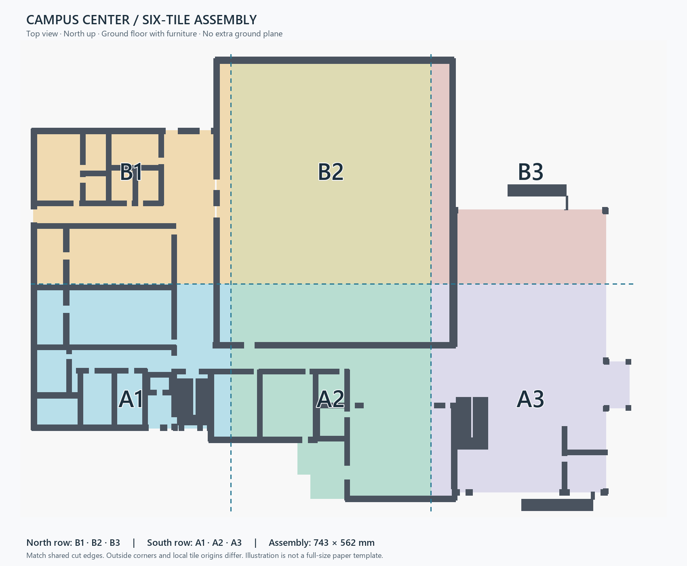
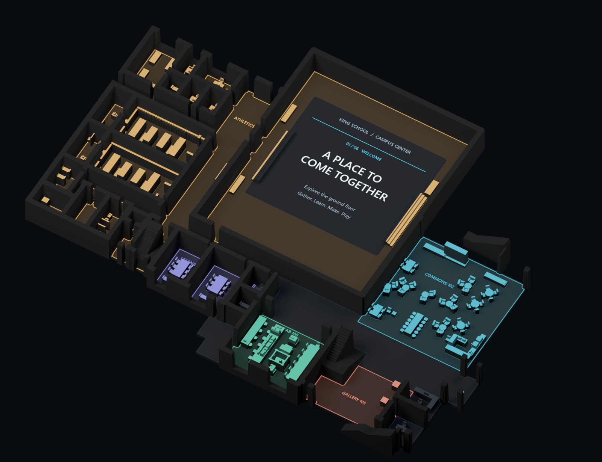

# Furnished ground-floor print and informational projection — v04

Created September 14, 2026. An isolated derivative of the current ground-floor structure and furnished projection scene. Earlier building, printing and projection files are preserved.

## Start here

- **Print:** unzip `Campus_Center_Furnished_Print_Package.zip`, then load the six individual files from `print_tiles/`. Choose STL or 3MF; they contain the same geometry.
- **CAD:** `Campus_Center_Ground_Furnished_1_87p5.step` is the complete furnished ground floor as one closed solid in millimetres. It is a faceted B-representation, without a parametric feature history.
- **Assembly:** `Campus_Center_Furnished_Assembly.3mf` preserves all six tiles in their final positions. Use this for assembly reference; use the individual tile files for separate print beds.
- **Watch:** open `information/index.html` in a browser or play `information/Campus_Center_Information_Preview.mp4`.
- **Project:** use the RGB master files and the alignment instructions below. The ordinary preview video is for review; its compressed YUV color may introduce faint edge bleed.
- **Edit/inspect:** `Campus_Center_Furnished_Print.blend` contains the exact print mesh; `Campus_Center_Projection_Receiver.blend` contains its orthographic receiver setup. `Campus_Center_Information_Preview.blend` is a packed digital presentation preview.

## Physical model

| Property | Value |
|---|---|
| Scope | Ground floor, fixed furniture, supported stairs and existing structural footprint |
| Scale | 1:87.5; the same size as the earlier 4× projection print |
| Assembled size | 743 × 562 × 53.568 mm |
| Floor thickness | 4.8 mm |
| Tile arrangement | 3 columns × 2 rows; six independent closed solids |
| Furniture sampling | 0.5 mm in plan; heights rounded upward in 0.2 mm steps |
| Fine-feature reinforcement | 0.5 mm outward in plan, restricted to the existing floor |
| Extra ground plane | None |
| Print orientation | Flat underside directly on the bed; Z upward |

The furniture is physical geometry. It includes simplified commons tables and seating, café counters and equipment, classroom tables/desks/chairs, iLab worktables and machines, office furnishings, locker banks and benches, bathroom fixtures, and floor-connected fixed elements present in the source scene.

Tables and chairs have filled undersides rather than open legs. Machines and fixtures are solid blocks or relief forms that extend down to the floor. Fine internal mechanisms, foliage, people and overhead objects are omitted. The result prioritizes robust recognizable silhouettes and receiving surfaces at this scale, rather than miniature moving parts. Adjacent small components may merge after reinforcement.

The structural outline, wall heights and stair geometry come from the existing support-free ground-floor print. This revision adds the furniture; it is not a new dimensional survey of the blueprints.

## Print and assemble

1. Use a matte white material so projected colors remain readable. Orient each tile as supplied, with its flat underside at Z = 0. Do not rotate it onto a side. Print at 100% scale in millimetres.
2. Turn supports off. Start with your established PLA profile; 0.16–0.20 mm layers and a 0.4 mm nozzle are reasonable starting settings for these reinforced forms. Adjust walls/infill to your material and printer. The CAD volume describes the outer solid, not a requirement to print at 100% infill.
3. Check the slicer preview, particularly narrow walls and chair backs. Each tile needs up to about 248 × 281 mm of bed area before any brim. A smaller printer will need new subdivisions; shrinking just one tile breaks the fit and projection registration.
4. Arrange the north row **B1 · B2 · B3** above the south row **A1 · A2 · A3**. Match the shared cut edges in `Assembly_Map.png`. The east-side entrance is on the right.
5. Butt the six seams together on a flat surface. The tiles have no additional interlocking tabs or alignment pins. Their irregular outside edges do not all share the same local origin; use the assembly map or the assembled 3MF rather than aligning bounding-box corners.
6. Secure the arrangement so it cannot shift during projection. Avoid glossy paint on receiving surfaces.

| Tile | Size X × Y × Z (mm, rounded) | Position of tile's local origin in assembly (X, Y mm) |
|---|---|---|
| A1 | 247.667 × 197 × 48.768 | 13, 92 |
| A2 | 247.667 × 270 × 48.768 | 260.667, 19 |
| A3 | 247.667 × 281 × 53.568 | 508.333, 8 |
| B1 | 247.667 × 281 × 48.768 | 13, 289 |
| B2 | 247.667 × 281 × 48.768 | 260.667, 289 |
| B3 | 219.667 × 281 × 53.568 | 508.333, 289 |

## Informational mapping

This first show is a **silent 42-second, 24 fps tour**. It uses localized color, room labels and short route pulses. Furniture tops can be highlighted independently. Wall tops and the exterior remain black in the projection signal, and there is no moving sun or crowd footage.

| Time | Chapter | Purpose |
|---|---|---|
| 0–6 s | Welcome | Show the connected ground-floor destinations |
| 6–13 s | Commons & café | Gathering, study and shared seating |
| 13–21 s | Innovation lab | Making, 3D printing and digital fabrication |
| 21–28 s | Learning & gallery | Collaboration, Aspire classroom and student work |
| 28–35 s | Athletics | Gym, team spaces, offices and changing facilities |
| 35–42 s | Connections | Revisit the shared circulation route |

Large captions sit on the clear gym floor. The routes follow the modeled walkable floor and avoid walls and furniture. The learning chapter's route ends in the corridor outside the classrooms. Zone highlights group related functions; they are not legal occupancy or departmental boundary drawings. Copy is editable in `information/show_plan.json`, with optional narration text provided but no voice track generated.

The editable generator is `build_information.py`. Its room captions, chapter timing and route targets are explicit. Changing text in `show_plan.json` alone does not re-encode the video; edit the generator and rerun it for a revised show. It uses Python with NumPy, Pillow and SciPy, plus FFmpeg at the path configured in that script. The retained scripts in `source_scripts/` document the original workspace build and depend on its source assets and CAD runtime; they are not a standalone installer.

### Projection files and alignment

- `Campus_Center_Information_Master_RGB.mp4`: 2048 × 1572, lossless RGB H.264, 1,008 frames.
- `Campus_Center_Information_1024x786_RGB.mp4`: 1024 × 786, lossless RGB H.264, 1,008 frames.
- `Campus_Center_Information_Preview.mp4`: broadly compatible H.264 review copy, 42 seconds.
- `Chapter_01.png` through `Chapter_06.png`: static chapter states.
- `Calibration_25mm.png`: alignment squares representing 25 × 25 mm on the physical model.
- `Furniture_Only.png`: furniture-top check.
- `Projection_Validity.png` and `Native_Validity.png`: permitted receiver pixels, with an edge inset.
- Root-level `floor_mask.png`, `furniture_mask.png` and `receiver_mask.png`: raw receiver renders before the inset.

The master image represents a **790.426 × 606.7137 mm canvas**, centered at assembly coordinates **X = 384.5 mm, Y = 289 mm**. Image top corresponds to model north / positive Y. A physical 25 mm checker square should measure 25 mm on the model. Keep the image proportions intact; use black letterboxing instead of stretching to a 16:9 projector.

Place the projector over the model and begin with the checker and receiving-surface modes. Align the outer outline, shared seams, walls and furniture tops, then focus and set brightness. This package assumes parallel, vertical rays. A real projector has lens perspective, so its height, offset and throw may require additional warping and height-aware calibration, especially at furniture tops. Physical alignment, focus and black level have not been tested here. Do not assume a floor-only four-corner adjustment also registers every raised surface.

The browser player provides chapter jumps, play/pause, full screen, overview, furniture, alignment and blackout. If file-based video playback is restricted in your browser, run `python serve_player.py` from this folder and open `http://127.0.0.1:8769/information/`. The optional server is local to this computer and supports video chapter seeking; Ctrl+C stops it. The player is for review/alignment, while RGB masters are intended for your mapping software.

## References and validation

The [Disney Xandar example around 3:40–4:00](https://www.youtube.com/watch?v=0vH0pd6N7oc&t=220s) informed the use of a subdued miniature with selected structures revealed through bright outlines and localized color. The [miniature-house example](https://www.youtube.com/shorts/4ZzGP8LLHxA) reinforced tight registration to the physical object. This package uses original Campus Center graphics and wording; it contains no copied Disney artwork or footage.

The furniture source and structural source are recorded with hashes in `furniture_source.json` and `print_validation.json`. These are preserved source snapshots, not overwritten scenes. The source extraction retained 595 candidate mesh components, of which 559 produced sampled print relief; these are component counts, not counts of furniture items.

Validation records:

- `print_validation.json`: full-mesh connection, volume, dimensions, support-free surface checks and tile layout.
- `cad_validation.json`: STEP reimport, one valid B-rep solid and volume agreement with the STL.
- `delivery_validation.json`: independent STL and 3MF reopens, assembly-coordinate checks, unchanged source hashes, and decoded RGB video checks for every frame.
- `receiver_contract.json`: camera canvas and receiving surfaces.
- `information/show_plan.json`: checked routes, chapter copy and reference observations.

Every print tile is watertight, consistently wound, one connected component, and has zero downward-facing surfaces above its flat underside. All 1,008 decoded frames of both RGB masters exactly match their pre-encode hashes, with zero non-black pixels outside the permitted receiver mask. These are digital checks; a physical print and projector calibration remain to be done.
